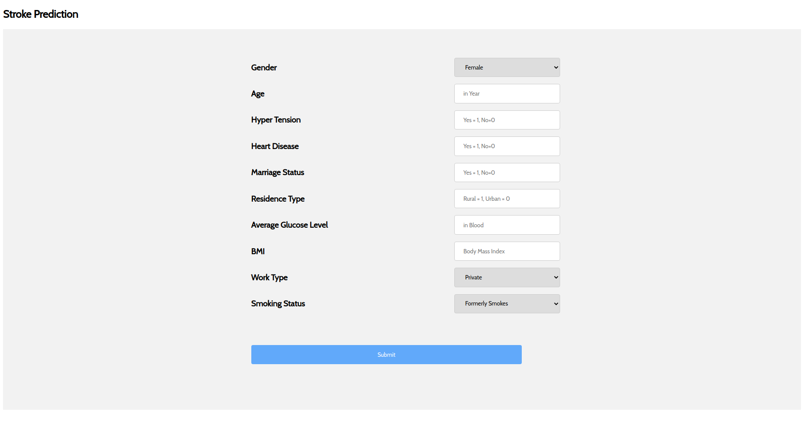

# Stroke-Prediction-Web-App

**The app was created using:**
- Frontend: **HTML** & **CSS**
- Backend: **Flask**

**How to use it:**

The way to use it, is very simple:

1. Execute `python health.py`
2. On a browser, insert the address shown on the terminal: `http://XXX.XXX.X.X:5000` or `http://localhost:5000`

